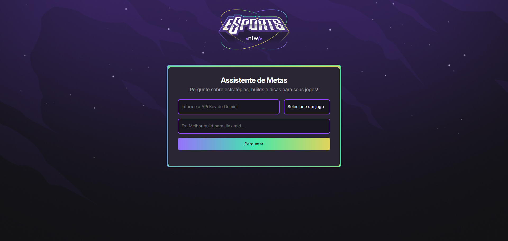
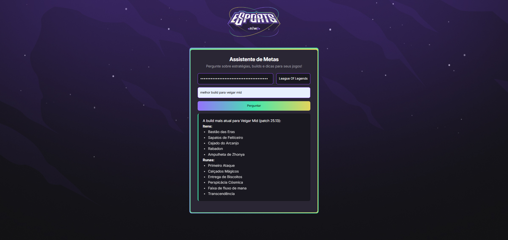

# 🧠 Game Meta AI – NLW #20 Agents (Rocketseat)

Este projeto foi desenvolvido durante o evento **NLW #20 - Agents**, promovido pela [Rocketseat](https://www.rocketseat.com.br/), com o objetivo de aplicar conceitos de desenvolvimento web aliados ao uso de inteligência artificial.

## 🎮 Sobre o projeto

A aplicação foi construída com foco em ajudar **jogadores de League of Legends (LoL), Valorant e CS:GO** a se manterem atualizados com os **metas atuais** de cada jogo.

### 🔍 Como funciona

1. O usuário seleciona o jogo que está jogando.
2. Digita uma dúvida sobre o meta ou sobre qualquer aspecto do jogo.
3. A IA (utilizando o modelo **Gemini 2.0 Flash**) analisa e responde de forma direta, contextualizada e atualizada com base na data atual.

O foco foi desenvolver uma interface simples e funcional, que demonstra na prática como uma IA pode ser integrada a projetos reais do dia a dia.

## 🛠️ Tecnologias utilizadas

- HTML
- CSS
- JavaScript
- Gemini 2.0 Flash (IA do Google)
- API Google Generative Language
- Markdown Rendering com Showdown.js

## 📸 Imagens do projeto

### 💻 Interface principal

### 🤖 Resposta da IA em tempo real

## 🚀 Aprendizados

Durante o projeto, foi possível reforçar conceitos importantes de:
- Consumo de APIs
- Prompt Engineering
- Manipulação do DOM
- Estruturação e lógica em JavaScript
- Integração de IA generativa em aplicações front-end

## 🔗 Créditos

Este projeto foi construído com base no conteúdo da **NLW #20 - Agents**, promovida pela Rocketseat.

---

### 👨‍💻 Por Gabriel Gomes  
Conecte-se comigo no [LinkedIn](https://www.linkedin.com/in/gabrielloureirodev/)

